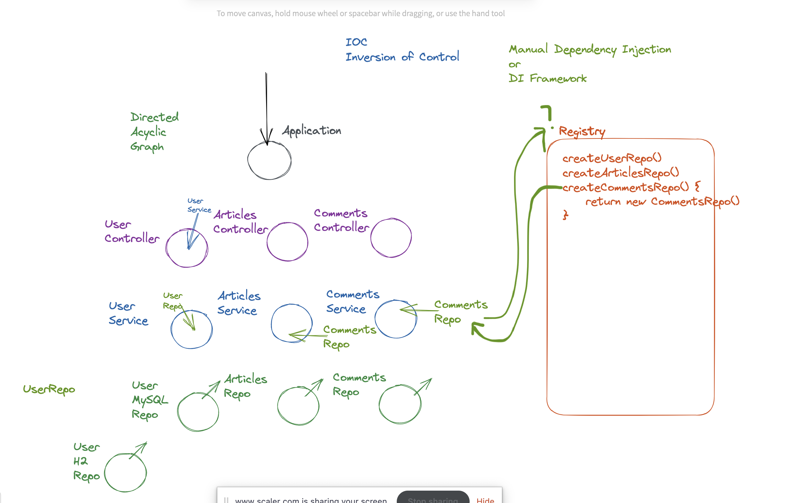
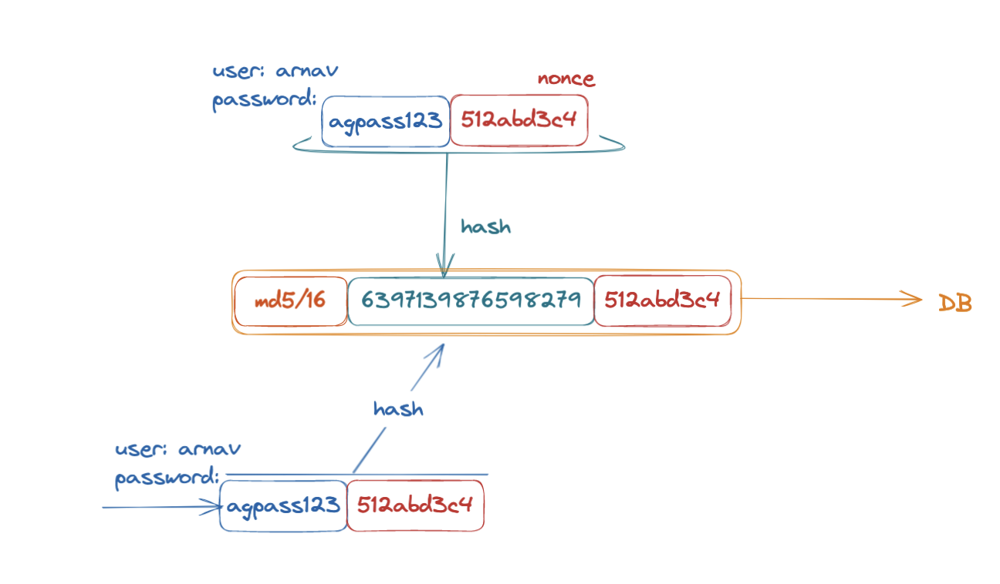
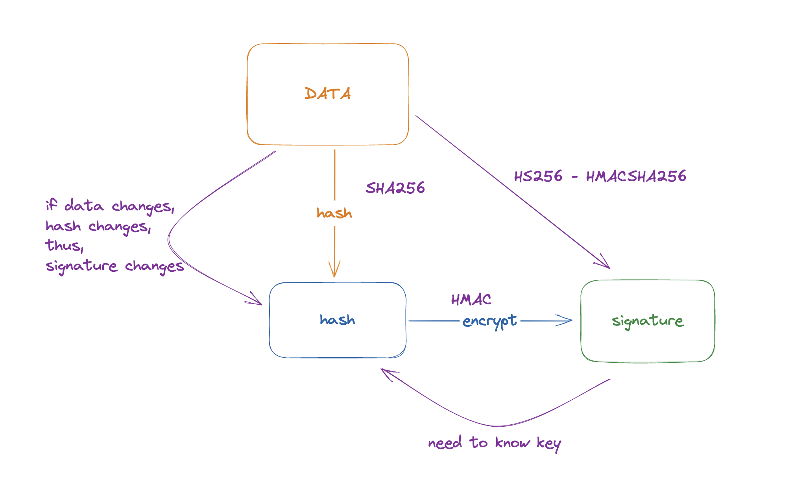

## API Discussions


/users/24/articles 🔵 						[{}, {}, ....]

/articles?authorId=24 🟢					[{}, {}, ....]

## DB Entities 

```
UserEntity {

	@OneToMany(fetch: EAGER)
	List<ArticleEntity> articles 🔵
}


ArticlesRepository {
List<ArticleEntity> findAllByAuthorId(UUID userId) 🟢
}


var user = usersService.findByUsername()
user.getArticles() 🔵

var articles = articlesService.findAllByAuthorId() 🟢 
```


## Dependency Injection Notes 

```
Application {

	switch (url.path) {
		case: "/users" 
			UserController {
				getUser() {
					UserService {
						getUser() {
							UserRepository {
								findUser() {
								 	
								}
							}
						}
					}
				}
			} 
		case: "/articles"
			articlesController.getArticles()
		case: "/comments"
			commentsController.getComments()
	
	}

}
```

```
Application {

	UserRepo userRepo = new UserRepo()
	Articles articlesRepo = new ArticlesRepo() 
	
	UserService userService = new UserService(userRepo)
	ArticlesService articlesService = new ArticlesService(articlesRepo, userRepo)
	
	UserController userController = new UserController(userService)
	ArticlesController articlesCongtroller = new ArticlesController(articlesService)
 
}


UserController {
	UserService userService
}

UserService {
	UsersRepository usersRepository
}
```



## Password Hashing and Birthday Paradox 


```

encryption
	- 2-way (can decrypt)
	- to decrypt need a key 


hashing 
	- eg MD5 
	- one-way (cannot get data from hash)
	- output is fixed size, input can be anything 
	

encoding 
	- eg. Base64, UTF-8
	- to represent in a given set of characters or format


A -> B
B -> C 
C -> D

hello -> ifmmp (rot = 1)
hello -> gdkkn (rot = -1)
----------------------------------------

Hashing 

	1. fixed output size (bounded)
	2. sufficiently random and not deterministic 
		hash(x1) -> y1
		hash(x2) -> y2
		then, relationship b/w x1 and x2 will not have any consequence 
		on relationship between y1 and y2
	3. one-way (no alogrigthm to do hash-inverse(y) = x) 
	4. collisions can happen 
		hash(x1) = hash(x2), can happen 


256-bit hash function 

x1, x2 -> P(hash(x1)=hash(x2)) = 1/(2^256)

1-bit hash function -> 0 or 1 
		
x1, x2 -> P(hash(x1)=hash(x2)) = 1/2


8-bit hashing function - is strong enough? 
if input set is 4 items => then YES
if input set is 1,000,000 items => then NO 


"Birthday Paradox"

Given N people in a room, what is the probability that any 2 of them have the same birthday?
(Imagine there are no leap years in our universe) 

N = 1		then P 			= 0
N = 2; 		then P = 1/365 	= 0.003
N = 183		then P = 
N = 366; 	then P 			= 1 


N = 3 

40

p1 -> X
p2 -> Y => 1-1/365 -> ..
p3 -> Z => 1-2/365 -> ..
p4 ->      1-3/365 -> ..


person1 -> X (given)
either person2 -> X or person3 -> X 


---------------

8-bit hash

input set - 2^8; then P = 1
intput set - 2;  then P = 1/2^8 


```

## Password Hashing 




## Crypto Signature 

