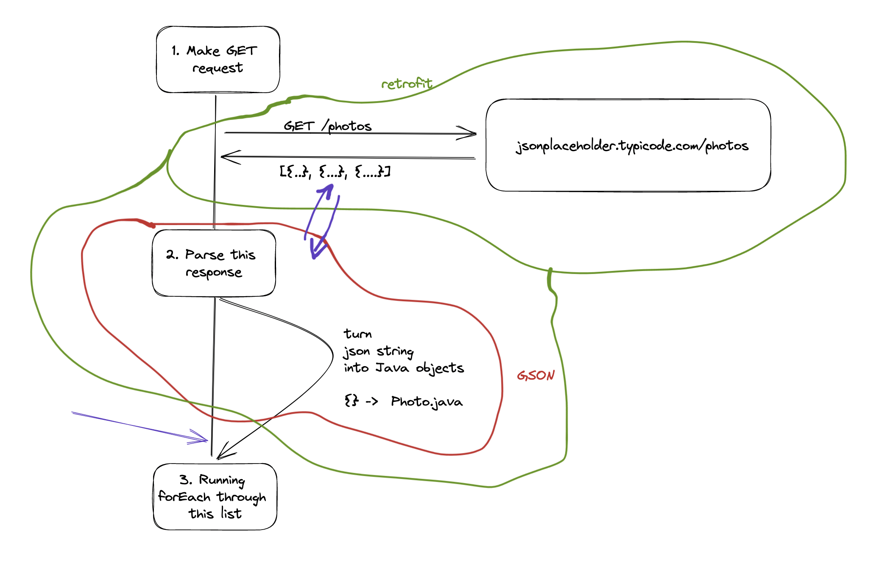

# Basic Java Project 

## Diagrams 

### 1. How Retrofit and GSON work together



## Build 

### Create Jar 

```bash
./gradlew build
```

The jar would be generated in `build/libs` folder.

### Creating Fat Jars 

A fat jar is a jar file that includes all the required libraries inside it. 
Far jars are easy to distribute and deploy as they do not require anything other
than a working Java Runtime Environment to run. 

Add this to `build.gradle`

```groovy
jar {
    manifest.attributes["Main-Class"] = "com.scaler.Main"
    duplicatesStrategy = DuplicatesStrategy.EXCLUDE
    from { configurations.runtimeClasspath.collect { it.isDirectory() ? it : zipTree(it) } }
}
```
or

Add this to `build.gradle.kts`
```kts

tasks.withType<Jar> {
    manifest {
        attributes["Main-Class"] = "com.scaler.Main"
    }
    duplicatesStrategy = DuplicatesStrategy.EXCLUDE
    from(configurations.runtimeClasspath.get().map({ if (it.isDirectory) it else zipTree(it) }))
}
```

Build and run the jar file
```bash
./gradlew build
java -jar build/libs/java-basics-1.0-SNAPSHOT.jar
```

## Assignments 

### 01: Merge Sort Files 

#### Problem Statement

Inside the folder [/files](./files) there are 2 files 
- [in1.txt](./files/in1.txt)
- [in2.txt](./files/in2.txt)

The both contain some numbers (separate numbers in each line).

You have to read both files, merge all the numbers into one sorted array 
and then print that into a third file [out.txt](./files/out.txt)

#### Example 

##### Input
Contents of `in1.txt`
```
4
7
2
```

Contents of `in2.txt`
```
1 
9
3
```

##### Output 
Contents of `out.txt`
```
1
2
3
4
7
9
```

##### Bonus 

- Level 1: Make the program work for any number of files.
- Level 2: Make sure that the file read and write operations are on a separate thread 
- Level 3: Make sure that the read operations can be all done in parallel (i.e. we are not waiting for file 1 to be read before we read file 2)

#### Submissions 

- Create a new repository under your own account (not a fork of this repo) 
- Create a `files` folder and copy `in1.txt` and `in2.txt` into it
- Finish the assignment, and upload the `out.txt` file to the `files` folder 
- The repository should contain the final working code as well as the `out.txt` file
- Submit your assignment on [this form](https://docs.google.com/forms/d/e/1FAIpQLSd04RVGJCkye5RvYhARL1cN2TSWZmLw9LeCTLbk1iw7lv5JEw/viewform)

### 02: Download photos from JSONPlaceholder and Save in folders 

#### Problem Statement 

On `https://jsonplaceholder.typicode.com/photos` there are 5000 photos. 50 each in 100 albums. 
The response contains the URL from where each photo can be downloaded. 

You have to download all the photos and save them in respective folders.

> We can just download 2 photos each from albums 1-10 for demo purpose

#### Example 

After download, the folder structure should look like this 

```
/albums
    /1
        9e59da.png
        a4bc66.png
    /2
        9e59da.png
        2cd88b.png
    /3
        9e59da.png
        2cd88b.png
    ...
    /10
        9e59da.png
        2cd88b.png
```

#### Submissions


- Create a new repository under your own account (not a fork of this repo)
- Create a `/albums` folder where the output will be stored
- Finish the assignment, and upload the final `/albums` folder
- The repository should contain the final working code as well as the `/albums` folder
- Submit your assignment on [this form](https://docs.google.com/forms/d/e/1FAIpQLSfCG3u656lsptYXsWfrgwl8mg6BcxmZIv_wXNV5fk46Nww7jQ/viewform?usp=sf_link)
